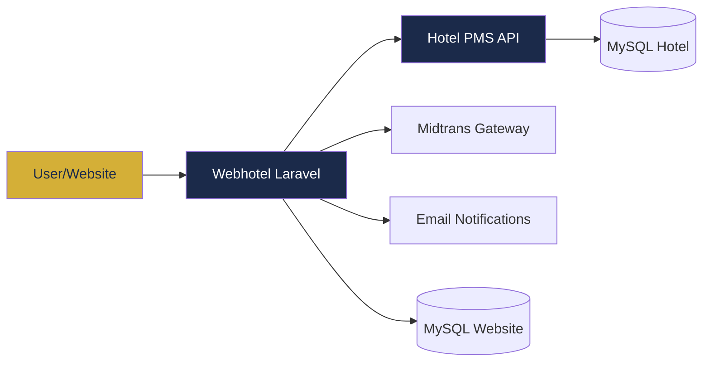

<p align="center">
    
    
    
    
</p>

# The Icon Hotel — Website

> **Website reservasi hotel modern** — Front-end publik untuk The Icon Hotel Kuningan, terintegrasi dengan **Hotel PMS** (Property Management System) untuk manajemen kamar, reservasi, dan pembayaran secara real-time.

---

## ✨ Fitur

### 🌐 Public Website
| Fitur | Keterangan |
|-------|-----------|
| **Hero + Booking Form** | Booking form dengan date picker, kapasitas tamu, dan math CAPTCHA |
| **Cek Ketersediaan Real-time** | AJAX check availability via PMS API (cache 2 menit) |
| **Daftar Kamar** | Tampilan tipe kamar dengan harga sinkron dari PMS |
| **Galeri & Fasilitas** | Galeri gambar hotel, daftar fasilitas dengan ikon |
| **Halaman Pelacakan Booking** | Lacak booking via kode unik (contoh: `ICN-A7B3K9`) |
| **Konfirmasi Booking** | Halaman konfirmasi dengan detail pembayaran bank |
| **Payment Gateway** | Integrasi **Midtrans** (Snap) + petunjuk transfer bank |
| **Contact Form** | Form kontak dengan honeypot anti-spam + rate limiting |
| **Anti-Spam Protection** | Honeypot fields, Math CAPTCHA, Rate Limiting (3 percobaan/5 detik) |

### 🔐 Admin Panel
| Fitur | Keterangan |
|-------|-----------|
| **Dashboard** | Statistik: total booking, room types, gallery, pesan, dll |
| **Manajemen Booking** | Lihat, konfirmasi, batalkan, hapus booking + kirim email notifikasi |
| **Invoice PDF** | Generate & download invoice otomatis (via DomPDF) |
| **Room Types CRUD** | Kelola tipe kamar, harga, kapasitas, gambar, fasilitas |
| **Fasilitas CRUD** | Kelola daftar fasilitas hotel dengan ikon |
| **Galeri CRUD** | Upload & kelola gambar galeri (WebP/JPG/PNG, max 5MB) |
| **Page Sections** | Edit konten halaman (hero, about, offers, dll) |
| **Settings** | Konfigurasi: info hotel, kontak, bank, sosial media, SEO |
| **Sync Harga dari PMS** | Sinkronisasi harga tipe kamar otomatis dari PMS API |

### ⚙️ Services & Integrasi
| Service | Peran |
|---------|-------|
| **PmsApiService** | HTTP client ke PMS API (endpoints: rooms, availability, reservasi, harga) |
| **MidtransService** | Payment gateway via Midtrans Snap (bank transfer, QR, dll) |
| **ReCaptchaService** | Google reCAPTCHA v2 server-side verification |
| **SyncPmsReservation Job** | Queue job untuk sinkron booking ke PMS (3x retry, 10s backoff) |
| **Email Notifications** | Auto-email: konfirmasi booking, notifikasi admin, status change |

---

## 🏗️ Arsitektur



### Alur Booking
1. User isi form booking → validasi + captcha
2. Cek ketersediaan via PMS API (`/api/rooms/available`)
3. Simpan booking ke database lokal
4. Kirim email konfirmasi ke guest + notifikasi ke admin
5. Dispatch job `SyncPmsReservation` → buat reservasi di PMS
6. User bayar via Midtrans / transfer bank
7. Admin konfirmasi booking → status berubah

---

## 🚀 Tech Stack

| Teknologi | Versi | Kegunaan |
|-----------|-------|----------|
| **PHP** | 8.3+ | Backend |
| **Laravel** | 13.x | Framework |
| **Tailwind CSS** | 4.x | Utility-first CSS |
| **Alpine.js** | 3.x | Interaktivitas frontend |
| **Vite** | 8.x | Asset bundling |
| **MySQL** | 8.x | Database |
| **Midtrans** | 2.6 | Payment gateway |
| **DomPDF** | 3.1 | Invoice PDF generation |
| **Guzzle** | 7.x | HTTP client ke PMS API |
| **Laravel Queue** | - | Async job processing |

---

## 📦 Instalasi

```bash
# Clone repository
git clone https://github.com/your-org/webhotel.git
cd webhotel

# Install dependencies
composer install
npm install

# Environment
cp .env.example .env
php artisan key:generate

# Konfigurasi .env untuk database & PMS API
# PMS_API_URL=http://127.0.0.1:8000
# PMS_API_KEY=your-api-key

# Migrasi database
php artisan migrate

# Build assets
npm run build

# Development
composer run dev
```

---

## 🔗 Integrasi PMS API

Webhotel terintegrasi dengan [Hotel PMS](https://github.com/your-org/hotel-pms) melalui REST API:

| Method | Endpoint | Fungsi |
|--------|----------|--------|
| `GET` | `/api/rooms` | Daftar semua kamar |
| `GET` | `/api/rooms/available` | Kamar tersedia (filter tgl) |
| `GET` | `/api/room-types/prices` | Tipe kamar + harga efektif |
| `POST` | `/api/reservations` | Buat reservasi baru |

Authentikasi via header `X-API-Key`.

---

## 🗂️ Struktur Database

### Tables (Website)
- `room_types` — Tipe kamar dengan harga, kapasitas, gambar
- `facilities` — Fasilitas hotel
- `gallery_images` — Galeri foto hotel
- `website_settings` — Konfigurasi website (key-value)
- `page_sections` — Konten halaman (hero, about, offers)
- `contacts` — Pesan dari form kontak
- `bookings` — Booking dari website

---

## 🧪 Testing

```bash
php artisan test --compact
```

---

## 👨‍💼 Admin Credentials (Dev)

- **URL:** `/admin/login`
- **Username:** `admin`
- **Password:** `password`

---

## 📄 License

**The Icon Hotel Website** — Proprietary. All rights reserved.
